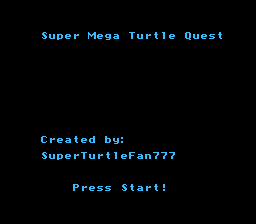

# Making Your First Change

Okay, you've set up a bunch of tools, built the game, and even played it briefly. You're probably 
wondering when you get to start making your own game. The answer is, right now!

Let's do something really simple to start - let's change the title screen a bit. Pick a name
for your game now. (Don't stress over it; this will be easy to change later!) We are going to
change the title screen to show it.

First, use your IDE to open `source/menus/title.c`. You should see a fairly simple file. Don't worry
too much about what is going on in this file, but near the top you should see a few lines like this: 

```c
// The name of your game :)
const unsigned char gameName[] = "Quirk's Adventure";
const unsigned char gameAuthor[] = "YOU!";
const unsigned char gameAuthorContact[] = "Tweet at us! @your_twitter";
const unsigned char currentYear[] = "2018";
```

These are all C strings used later in this file to draw the name on the title. Change the text after 
`gameName[]` to be the name of your game. If your game name contains A single quote (`"`), be sure
to escape it using a backslash. (`\"`)

The next line is the game's author. Change this to your name, or some other way you like to be 
identified. 

The line after is a way to contact you - we used Twitter in our example, but change this to whatever
you like! Or, remove it entirely.

Now, compile and run the game again (Press `f6` in Visual Studio Code, or run `make clean && make && make run` 
in the Cygwin terminal). 



The title screen should now show your game name and author. Congratulations, you've officially started
programming your NES game!