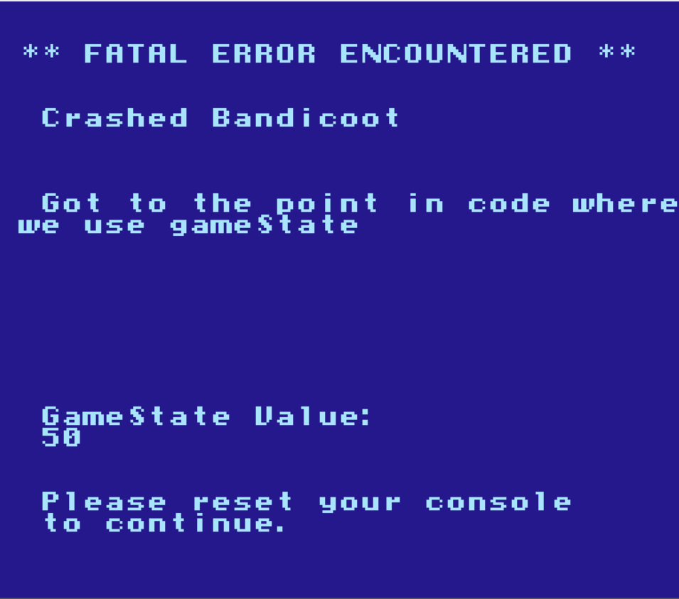

# Frequently Asked Questions

This section tries to address common questions and answers for new developers.

If you have a question that isn't addressed here, feel free to oepn a Github issue, or reach out on
Twitter/somewhere else.

#### Can I play my game on a real NES?

Absolutely! This engine produces roms that are completely compatible with the NES - they are not limited
to just emulators. It's actually very easy with the right hardware.

There's [a whole chapter about this](../section_4/real_nes.md) in section 4! 

#### Can I use this for Game Jams/Coding competitions?

As far as I'm concerned, definitely! I have used this for multiple Ludum Dare games. Multiple of the games
on [my site](https://cpprograms.net) were started off this repository. (Though an older version that does not
use create-nes-game.)

If the contest allows "base code", or "engine code" or something similar, this should qualify.

This does include some basic music and sprites and levels - if you are required to create
all of your content as part of the Jam, you should be sure to remove this content before the end
of the contest.

Here is a list of all non-engine content to be aware of: 

1. Music and sound effects in the famitracker files in the `sound/` directory.
2. The Tiled maps in the `levels/` directory.
3. Nesst graphics in the `graphics/` directory

#### My game doesn't have the change that I expected. What do I do?

This shouldn't really ever happen, but well, sometimes it does! This may be due to a mistake in the engine, or
due to new code that has been added that doesn't line up with what the `makefile` expects. There are a few things
we can try...

##### 1. The "dangit" fix: Make sure all of your files are saved

Hey, we all forget to hit `ctrl+s` sometimes!

##### 2. Clean up generated files, and rebuild from scratch

This is the equivalent to turning it off and on again. In your cygwin terminal in the base of `nes-starter-kit`,
run `create-nes-game clean`, then build it again. This will get rid of all temporary files on your system, forcing us to
re-generate all files. If you find yourself doing this often, you may want to open a ticket with
`nes-starter-kit` on GitHub so we can fix this in the project itself.

##### 3. Change something else, and see if that works

When all else fails, this can help find problems, or just help verify that the system is working. Make another change
that should break the build (a syntax error for example) and prove that breaks it. If it doesn't, the file you are
editing may not be included in the build, or an older version might be included in the build.

Next, try removing this error, and make a change to code that will be extremely obvious if it happens. One option is
to add an infinite loop, such as `while(1) {}` to the area in question. If the game crashes, you got to that point. 
If this works, you know where you are in code execution. If not, try to move this thing earlier in execution until it
behaves as expected.

Another option is to comment out part of the code that does something obvious, and see if that thing keeps happening.

Finally, if you need to see state, you can trigger an error that crashes the game and prints state information by 
running the `crash_error()` method. You have to include the `source/menus/error.h` first. It looks like this: 

```c
crash_error("Got Here", "You got to this point in the code", NULL, NULL);
```

You can inject this in various places to see where you get to. You can also provide a variable as needed, like this:

```c
crash_error("Crashed Bandicoot", "Got to the point in code where we use gameState", "GameState Value", gameState);
```



This can help figure out the state of variables and more when the game crashes.


This part is always painful, but just try to keep probing at things until you learn something about the problem. You
also might want to try reaching out to someone and talking through the problem (even if they're not familiar with
`nes-starter-kit`) to see if it helps you come to a solution. I hope this helps, and don't be afraid to reach out for
help!

#### What is all the `CODE_BANK` / `banked_call()` stuff about?

The NES has very limited space for code, and for graphics/etc. It does not know how to use more than 32 
kilobytes of this data at once. This may not make much sense, since many games are 512kb or 
larger! Our game actually uses 128kb of space by default. How is this possible?

The short answer is, we separate the code into smaller 16k sections, and switch out which ones the
NES knows about at once. (This is known as ROM banking) The `CODE_BANK(number)` syntax tells the compiler
which of these 16k sections the code belongs in. The `banked_call` method runs code that is in one of
these sections.

This is explained in greater detail in the 4th section, in a chapter titled "Understanding and adjusting 
the size of your game."

#### I see some code that defines a variable as another, like `#define mapSpriteDataIndex tempChar1`. Why?

The NES has an extremely limited amount of RAM. There are 2 kilobytes, and there are 256 bytes that operate
a bit faster than the rest, known as the zero page. Because of this, sometimes it makes sense to re-use the
same variable for multiple things. When you see code like this: 

```C
#define currentValue tempInt1
#define currentMemoryLocation tempInt2
```

It means we are creating a nickname of `currentValue` for the variable `tempInt1`. The code would work the same way
if you just put in tempInt1, but this helps made the code easier to understand. Changing it means changing tempInt1.

This is important to remember, as we give multiple nicknames to this variable. If one function updates tempInt1 using
the `currentValue` nickname, then you call a function that changes tempInt1 from another nickname, the next time you
read `currentValue` you will get the wrong value.

Here are a few suggestions to avoid conflicts: 
1. Place defines close the function using them, so it is easy to look at which values are in use.
2. Only use nicknames in functions called directly from the main loop. This way, the situation above is not possible.
3. Avoid using any of the temp variables in the nmi, or methods called by it. This *will* cause problems eventually.

#### Why do a lot of functions have `void` in the parameters rather than being blank? 

(Or, why use `unsigned char doStuff(void) {` instead of `unsigned char doStuff() {`)

This is because of how C works. While omitting the word `void` works in some cases, having nothing between the parenthesis
actually means "this function could have any number of parameters" instead of "this function has no parameters". This can 
confuse the compiler, and generally isn't very helpful for NES games. 

If you are used to seeing `void myFunction() {` and `unsigned char myFunction() {` in other languages, try to remember
to use `void myFunction(void) {` and `unsigned char myFunction(void) {` instead.


#### What does `Warning: Memory area overflow` mean?

In short, it means you tried to fit too much data/code into the area given. Check out the chapter titled
"Understanding and adjusting the size of your game" in section 4. 

#### I got an error like `temp/map.s(203): Error: ':' expected` in a `.s` file. What do I do?

This appears to be caused by a bug with our assembler (ca65) that happens when your C file has 
really long lines. This can usually be worked around by splitting the function call (or anything)
onto multiple lines. 

```c
// Problem line: 
oam_spr((spritePosition << 4) + (NES_SPRITE_WIDTH/2), HUD_PIXEL_HEIGHT + (spritePosition & 0xf0) + (NES_SPRITE_HEIGHT/2), spriteDefinitions[spriteIndex + SPRITE_DEF_POSITION_TILE_ID], (spriteDefinitions[spriteIndex + SPRITE_DEF_POSITION_SIZE_PALETTE] & SPRITE_PALETTE_MASK) >> 6 , FIRST_ENEMY_SPRITE_OAM_INDEX + (i<<4));

// Workaround:
oam_spr(
    (spritePosition << 4) + (NES_SPRITE_WIDTH/2), 
    HUD_PIXEL_HEIGHT + (spritePosition & 0xf0) + (NES_SPRITE_HEIGHT/2), 
    spriteDefinitions[spriteIndex + SPRITE_DEF_POSITION_TILE_ID], 
    (spriteDefinitions[spriteIndex + SPRITE_DEF_POSITION_SIZE_PALETTE] & SPRITE_PALETTE_MASK) >> 6, 
    FIRST_ENEMY_SPRITE_OAM_INDEX + (i<<4)
);

```

#### I got an error like `Error: Call to undefined function 'test_collision'`. What do I do?

First, check for typos. I'm guessing if you got here you probably did that, huh? Oh well, have
to mention it!

This error usually means that you need to include a header file (`.h`) that is missing. If this is an
existing method, it is probably already present in a header file that you need to include. Search the
project for that method, and if you find it in a `.h` file, include that file at the top of yours using
`#include "the/file.h"`. 

**NOTE**: If that header file contains code like this: 

```c
#define PRG_BANK_MAP_SPRITES 2
```

You need to call it using the `banked_call` method, as described in an earlier FAQ answer. 

If this is a new method that you are adding, you may need to add your function definition to a header
file yourself. (Or create one, if this is a new method!)

There is a quick explanation of header files in C available 
[here](https://www.quora.com/What-is-the-use-of-header-files-in-C-language).

#### I got an error like `Unresolved external _variable referenced in temp/my_file.s`. What do I do?

This error is a bit confusing, but usually means there's a problem somewhere in your C code. Usually,
it means you have an extern variable (or one defined with `ZEROPAGE_EXTERN`) defined in a header file 
without having a matching variable definition in a c file. 

`extern` basically tells C "I defined this somewhere... just trust me, it's there!" The variable or 
function has to be defined in a C file. (or asm file, technically) If the variable you reference with
`extern` isn't found, the error only comes up at the very end when the linker combines all of your 
files. This is after C is compiled down to assembly, hence the error showing up in an assembly file.

You'll need to add a definition for the variable matching the extern. (Or a `ZEROPAGE_DEF` if you 
used a `ZEROPAGE_EXTERN`.)

#### Why are the tools for flashing my NES cartridge not included in the tool zip?

There are two reasons why these tools were excluded. The first one is that, simply, not everyone 
needs the same tools. This depends on which path you go with your game. As such, I did not want
to include unnecessary tools and make the tool list harder to understand.

The second is that playing games on hardware isn't a main focus of this project. The idea is to 
give you the tools to make your own game - past that point you can do whatever you want with it.
