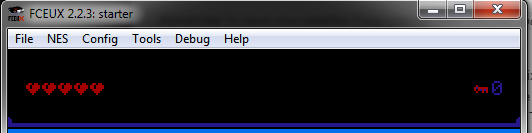

# Changing the HUD

The HUD is the thing that shows you information about your player. As it is set up, it will
show you the player's health, and the number of keys you hold. This is mainly handled in a 
file named `source/graphics/hud.c`. There are two methods we care about: `draw_hud()` and
`update_hud()`.

 

## draw_hud()

This method is responsible for drawing the initial hud onto the screen whenever the screen
is completely redrawn. It is responsible for drawing the blank tiles onto the screen, as
well as the border that we show at the bottom. If you want to add new static content, this
is the place.

## update_hud()

This method is run once every frame, and is responsible for drawing the number of hearts
the player has, as well as the number of keys they have. If you want to add new variable
things, this is where to do it. 

## Making a Change

Okay, now you've seen this code; let's make a change! If you pop open our tile editor
(NESST) and look at `graphics/tiles.chr` - towards the bottom you should see some text
that says "Player" - why don't we put that on the hud?


First, we need to find out how to reference these tiles. If you hover over the `P`, the
tile number should appear at the bottom of the tool. In this case it is `$ea`. We can
put this into a constant in `source/graphics/hud.h`. If you open this file, you will 
see a list of constants, like this:

```c
#define HUD_TILE_BORDER_BL 0xf4
#define HUD_TILE_BORDER_BR 0xf5
#define HUD_TILE_BORDER_HORIZONTAL 0xe5
#define HUD_TILE_BORDER_VERTICAL 0xe4
```

If we add our new one under this:
```c 
#define HUD_TILE_PLAYER_TEXT 0xea
```

We can then reference it from the code in `source/graphics/hud.c`. If we look at the
existing code, it seems to put a bunch of tiles onto the map using vram_put. We can
simply add to the end of this by picking a new address, and writing our "Player" text.

Next, we need to figure out where on the screen to draw. If we look at the `draw_hud()`
method, we can see we already have a constant for the starting position of the HUD. Looking
further down at the `update_hud()` method, there are positions for keys and hearts. We can 
probably figure out a good position for this text.

If we look back to `source/graphics/hud.h` again, we can see positions for the things in the HUD:
```c
#define HUD_POSITION_START 0x0300
#define HUD_HEART_START 0x0361
#define HUD_KEY_START 0x037d
#define HUD_ATTRS_START 0x03f0
```

Why don't we try adding a new constant for `HUD_POSITION_PLAYER_TEXT_START`. We know that rows
of tiles are 32 tiles (0x20 tiles, in hex) long. If we wanted to put our text on the next row
after we show hearts, we might add 0x20 to that address, and get 0x381. Add this to 
`source/graphics/hud.h`
```c
#define HUD_POSITION_PLAYER_TEXT_START 0x0381
```

Okay, almost done; we just need to write a little code to draw it! If we look back at the 
`draw_hud()` method, we see it call `vram_adr(NAMETABLE_A + HUD_POSITION_START)`, then call
`vram_put(/* value */)` a bunch of times. At the bottom, we use this to draw a border at the bottom
of the HUD. We want to add our new code below this.

You might be tempted to find out where the loops write to that position and replace part of the loop, 
and that will technically work. However, this method is called very rarely so we have no issue with
it being slow. Let's just write over the HUD a second time using our new address, giving ourselves
more readable code. Here's the code, with explanation in-line using comments: 

```c
void draw_hud() {
    // ... a bunch of other code...
    vram_adr(NAMETABLE_A + HUD_BORDER_START);
    for (i = 0; i != 16; ++i) {
        vram_put(0xff);
    }

    // End of existing code - you want to add the stuff below this point!
    // This sets us up to start writing to the address we want the player text at.
    vram_adr(NAMETABLE_A + HUD_POSITION_PLAYER_TEXT_START);
    // Next, we write a quick loop to go over each character of player and write it.
    for (i = 0; i != 6; ++i) {
        // One-by-one, write the characters to the screen.
        vram_put(HUD_TILE_PLAYER_TEXT + i);
    }
```

That's it; you're done! Run the game, and you should see something like this: 


## Adding dynamic data into the hud

That was all cool, but the HUD is mainly useful for information that is constantly changing. What if
we wanted to show another value here? We can do that too!

As an example we will show the current frame count on-screen. This is a number that is updated by the engine
once every time the NES redraws the screen. We are also going to take a shortcut, and show the number as 
hexidecimal, rather than converting it to an integer. This will result in us showing other tiles when a 
digit is between `0xa` and `0xf`

Let's do it! Open up `source/graphics/hud.c` and take a look at the `update_hud` method. You should see
a bunch of updates to an array called screenBuffer. They seem to update the player's health, max health, 
and number of keys. It looks kinda like this: 

```c
// This sets up screenBuffer to print x hearts, then x more empty hearts. 
// You give it the address, tell it the direction to write, then follow up with
// Ids, ending with NT_UPD_EOF

// We use i for the index on screen buffer, so we don't have to shift things around
// as we add values. 
i = 0;
screenBuffer[i++] = MSB(NAMETABLE_A + HUD_HEART_START) | NT_UPD_HORZ;
// ... This continues for a little bit.

// Next, draw the key count, using the key tile, and our key count variable
screenBuffer[i++] = MSB(NAMETABLE_A + HUD_KEY_START) | NT_UPD_HORZ;
screenBuffer[i++] = LSB(NAMETABLE_A + HUD_KEY_START);
screenBuffer[i++] = 2;
screenBuffer[i++] = HUD_TILE_KEY;
screenBuffer[i++] = HUD_TILE_NUMBER + playerKeyCount;

screenBuffer[i++] = NT_UPD_EOF;
set_vram_update(screenBuffer);
```

The first thing we want to think about is - will the `screenBuffer` variable hold our new value? It
looks like right now we use about 14 bytes, from adding up all of the places we increment i. (Including
the for loops); If we look at the definition in `source/globals.c`, it reserves 0x20 (32) bytes. So, we
will be okay as long as we add less than 18 additional bytes.

Next, we need to find a place to put it. We see the code is using variables like `HUD_KEY_START` in
it. If we look around, we find out this variable is defined in `source/graphics/hud.h`, so let's add a
new constant for our thing. I want to put it above the keys, by two rows, so I'll subtract two rows (0x40)
from that value. Here's the new constant: 

```c
#define HUD_FRAME_COUNTER_START 0x033d
```

Let's save this file and start using it. If we reopen `source/graphics/hud.c`, we can start adding code
for our new value. We can use the key text as an example. We just need to separate out the two digits
of `frameCount`. We can get the first digit by shifting down to divide by 16; this will give us our
first digit. The second one can be obtained using a logical AND to block out the first value.

Here's what it ends up looking like:

```c
// Draw the current frame count, letting digits larger than 9 show up as tiles
screenBuffer[i++] = MSB(NAMETABLE_A + HUD_KEY_START) | NT_UPD_HORZ;
screenBuffer[i++] = LSB(NAMETABLE_A + HUD_KEY_START);
screenBuffer[i++] = 2;
screenBuffer[i++] = HUD_TILE_NUMBER + ((frameCount >> 4) & 0x0f);
screenBuffer[i++] = HUD_TILE_NUMBER + (frameCount & 0x0f);

screenBuffer[i++] = NT_UPD_EOF;
set_vram_update(screenBuffer);
``` 


If you save, then run the game, you should see a frame counter in the upper right corner that is constantly changing. 
Success! _Note that you will see map tiles mix into this regularly_ - this is because we do not have tiles for 
hexidecimal digits above 9. This is expected!)