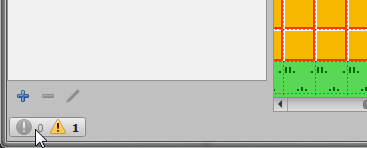
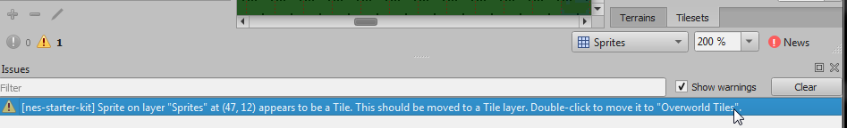
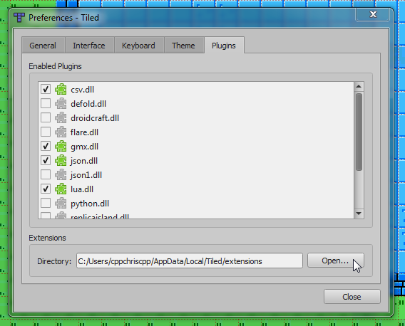

# Changing the World

Changing the map is one of the simplest changes we can make. The game works off of a 8x8 room grid,
which themselves are made up of 16x12 tile rooms. These can be edited graphically using Tiled, which
you should have installed in chapter 1.

To start, open `Tiled`, then select `Open` from the file menu, and find `levels/overworld.tmx`. You should see
a screen like this: 

The panel in the middle is your world. The panel on the top-right is a list of layers, and the bottom-right
has a set of your tiles to put on the map. The properties panel on the left can ignored or closed.

### Important Note

The first thing to be aware of is which layer you have selected on the top right. If you want to edit the map,
be sure to select `Overworld Tiles`. You have to pair this with tiles from the `Overworld Tiles` tileset on the
bottom right panel. If you want to change sprites, you want to use the `Sprites` layer, and the `Sprites` tileset. 

**If you mix these two, the compiler will fail when it tries to build your levels.**

Beyond that, just make the rooms look like you want them to, then save the tmx file and build your game. 
**Bam!** level designs updated!

#### Tiled extension

I have developed a Tiled extension to make editing maps a bit easier. Its main function is to tell you when you 
mix up the tile and sprite layers. It does this by showing a little warning in the lower left: 

Clicking on it will show you details, and let you double click to have the editor try to auto-fix the problem:

.

Finally, this adds an option to the `Map` menu (and the shortcut `ctrl+shift+k`) to automatically fix any of
these errors.

##### Tiled Extension Installation

_**Note**: This requires at least version 1.3.1 of Tiled. Earlier versions do not have extension support!_

Convinced? To install it, open Tiled, and follow these steps:

1. Go to the `File` menu, then click `Preferences`. 
2. Click the `Open...` button. This will is your extension folder for Tiled.
 
3. In a new explorer window, open the
[tools/tiled_extension](../../tools/tiled_extension) folder
4. copy the `nes-starter-kit-tiled` folder from here into the extensions folder you opened in step 2.

### Sprite limit

By default, you can put a maximum of 8 sprites on a single map tile. If you add more than this, the last
few will be skipped, and your build command will output warnings. Try to keep this limit in mind while 
adding to your map! 

### Can I change the size of the map?

Unfortunately, right now the size of the map is fixed at 128x96 tiles. If you want to change this, you would have
to change a few pieces of code in [map.c](../../source/map/map.c), as well as some of the logic in the map conversion
tool [tmx2c](../../tools/tmx2c). This is a rather advanced topic, and there is no guide on how to go about this yet. 

If you want a smaller map, your easiest solution is to build your map within the 128x96 tile grid. If you want something
smaller, you can always fill the extra space with blank tiles. Alternatively, you can create one map with multiple sub-maps
within it. This is the approach the original Legend of Zelda took. (See the "Dungeons (unified)" map on 
[this page](https://ian-albert.com/games/legend_of_zelda_maps/). 

## The room grid

There is also a layer called `Room Grid` - this layer just has the faint outlines that separates the rooms. This
layer is locked, so you can't accidentally place tiles/sprites on it. (To unlock it, just push the lock icon in 
the `layers` section.) The grid lines appear on the bottom and right of each room. This layer is ignored when 
creating the rom.