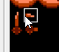

# Giving the main character a sword


Up to this point, our main character has been completely defenseless. It's probably time to change that, 
huh? This chapter will help you create a weapon for your main character and start using it. This chapter is
broken into a few pieces, but the end result is available in the `add_sword` branch. The rom is also available
[here](https://s3.amazonaws.com/nes-starter-kit/add_sword/starter.latest.nes).

## Getting started: showing the sword

Our first step is showing the sword when the player presses a button. We chose the A button.

There is a lot of code in this branch, but we'll work though it all; it's not that scary!

First, we'll want to set up some constants for this sword, so we know where the sprite is, and also know what
graphics to show. Before we show this, it's worth thinking about where to put these sprites. The NES has the
ability to show 64 sprites on-screen at one time. Sprites are 8x8 tiles, and most everything we show is 16x16, 
and is actually made up of 4 hardware sprites. We use the term `sprite` interchangably, but it is helpful to 
know what is going on behind the scenes.



At any rate, we need to find a place to put our new sword meta-sprite. If you look at the graphics, you can see that
it takes up a 16x8 space, or 2 sprites. the player takes up 4 sprites, and each enemy also takes up 4 sprites. The 
first sprite is also special, and is used for engine stuff. (This is known as `Sprite 0` - we need to avoid using it). 
All sprites take up space between addresses `0x200` to `0x2ff` - the table below shows all of the available sprite
space; we can use it to pick a place for our new sprites.

### Sprite (OAM) Memory layout

| Address range   | Use                    | 
|-----------------|------------------------|
| 0x200 - 0x20f   | Sprite 0, other 3 open |
| 0x210 - 0x21f   | Player                 |
| 0x220 - 0x22f   | Open (use for sword)   |
| 0x230 - 0x23f   | Open                   |
| 0x240 - 0x24f   | Map Sprite #1          |
| 0x250 - 0x25f   | Map Sprite #2          |
| 0x260 - 0x26f   | Map Sprite #3          |
| 0x270 - 0x27f   | Map Sprite #4          |
| 0x280 - 0x28f   | Map Sprite #5          |
| 0x290 - 0x29f   | Map Sprite #6          |
| 0x2a0 - 0x2af   | Map Sprite #7          |
| 0x2b0 - 0x2bf   | Map Sprite #8          |
| 0x2c0 - 0x2cf   | Open                   |
| 0x2d0 - 0x2df   | Open                   |
| 0x2e0 - 0x2ef   | Open                   |
| 0x2f0 - 0x2ff   | Open                   |

In our case, we've chosen `0x220`, but we could also choose any of the other spots marked open. We are also 
only using 2 of the 4 hardware sprites here; we could use the other two for another weapon if we wanted to.

At any rate, we need to add all of this information into our game. We add the following code to 
`source/sprite/player.h` to let us use this information:

```c
// We hve a few free sprite slots before the map sprites start - the weapon (sword) the player has will
// take up the first two sprites at 0x20.
#define PLAYER_WEAPON_OAM_LOCATION 0x20

// Where  in our list of files can we find the sword graphics?
#define PLAYER_SWORD_TILE_ID_H1 0xd1
#define PLAYER_SWORD_TILE_ID_H2 0xc1
#define PLAYER_SWORD_TILE_ID_V1 0xd0
#define PLAYER_SWORD_TILE_ID_V2 0xc0

// The width and height of the sword sprite for collisions
#define PLAYER_SWORD_SIZE_LONG (14 << PLAYER_POSITION_SHIFT)
#define PLAYER_SWORD_SIZE_SHORT (4 << PLAYER_POSITION_SHIFT)

// Define the number of pixels away from the character to set the sword when fully extended.
#define PLAYER_SWORD_POSITION_FULLY_EXTENDED 14
```

The tile ids are simply the ids gotten from NES Screen Tool, like we've done before. `PLAYER_WEAPON_OAM_RANGE` is the
last two digits of the address we want to use. (Since all sprites are between `0x200` and `0x2ff` we can use one byte
to store it.)

Also of note, we added a `swordPosition` variable into here and `source/sprite/player.c` so we can know when the sword
is out. Next, let's start using it. 

-----

Next, we need to start testing for collisions. We're going to make a lot of changes to `source/sprites/player.c`.

First, let's actually set our `swordPosition` variable whenever the player presses A. We include a little special
logic to only trigger this if the sword button is initially pressed down by checking if the button was pressed
the last time we checked. We add it at the beginning of the `handle_player_movement()` method.

```c
if (swordPosition == 0 && controllerState & PAD_A && !(lastControllerState & PAD_A)) {
    swordPosition = PLAYER_SWORD_POSITION_FULLY_EXTENDED;
} else if (swordPosition != 0) {
    swordPosition -= 2;
}
```

This also moves `swordPosition` back down after we initially show it, so we only show it for a limited time.
We also use this variable to animate it disappearing back into the player's sprite.

With that done, now we need to draw the sword whenever it is on-screen. To do this, we'll add a little bit
of new logic to the `update_player_sprite()` method, which is used to draw the player sprite. We add this onto
the bottom: 

```c
if (swordPosition) {
    switch (playerDirection) {
        case SPRITE_DIRECTION_RIGHT:
            oam_spr(rawXPosition + swordPosition, rawYPosition + 6, PLAYER_SWORD_TILE_ID_H1, 0x00, PLAYER_WEAPON_OAM_LOCATION);
            oam_spr(rawXPosition + swordPosition + NES_SPRITE_WIDTH, rawYPosition + 6, PLAYER_SWORD_TILE_ID_H2, 0x00, PLAYER_WEAPON_OAM_LOCATION + 0x04);
            break;
        case SPRITE_DIRECTION_LEFT:
            // The same logic for the other 3 directions, with slightly different coordinates...
            // ... and so on
    }
} else {
    oam_spr(SPRITE_OFFSCREEN, SPRITE_OFFSCREEN, PLAYER_SWORD_TILE_ID_H1, 0x00, PLAYER_WEAPON_OAM_LOCATION);
    oam_spr(SPRITE_OFFSCREEN, SPRITE_OFFSCREEN, PLAYER_SWORD_TILE_ID_H2, 0x00, PLAYER_WEAPON_OAM_LOCATION + 0x04);
}
```

This logic will draw the sword onto the screen whenever the player hits a, then quickly withdraw it and hide it. 
You can go ahead and try this now - the sword won't do anything yet, but you can see it!

While we are in this file, we also prevent the player from starting a screen transition or turning while their
sword is out, to avoid weird behavior. The code is not reproduced here, but we end up changing a lot of
lines from `if (playerInvulnerabilityTime)` to `if (playerInvulnerabilityTime || swordPosition)`.

## Making the sword actually do something

Okay, so we have a nice looking sword that we can slash, but it doesn't really do anything. Our next step is to make
the sword actually hurt enemies. We have some collision logic for the player and sprites right now in the
`source/sprites/map_sprites.c` file, specifically in the `update_map_sprites()` method. This then gets picked
up later in the `handler_player_sprite_collision()`. This will be passed around using a new variable called 
`lastPlayerWeaponCollisionId`, which we define in `map_sprites.c`. We'll be modifying both of these, but we will 
start in the `update_map_sprites()` method in `map_sprites.c`.

This method currently looks at the position of the player and each sprite, and sets the `lastPlayerSpriteCollisionId`
variable if any collide. We're going to duplicate this logic to test for collision with the sword whenever it is
swinging. To do this though, we first have to know where the sword is. We define the temporary variables 
`playerSwordX`, `playerSwordY`, `playerSwordWidth` and `playerSwordHeight` variables to track this. If the sword
is currently swinging, we will set these at the top of the method, then use them within the loop to test collision.
Here's what that calculation looks like: 

```c
    lastPlayerWeaponCollisionId = NO_SPRITE_HIT;

    if (swordPosition > 4) {
        playerSwordX = playerXPosition;
        playerSwordY = playerYPosition;
        switch (playerDirection) {
            case SPRITE_DIRECTION_RIGHT:
                playerSwordX += PLAYER_WIDTH_EXTENDED;
                playerSwordY += (PLAYER_HEIGHT_EXTENDED / 2);
                playerSwordWidth = PLAYER_SWORD_SIZE_LONG;
                playerSwordHeight = PLAYER_SWORD_SIZE_SHORT;
                break;
            case SPRITE_DIRECTION_LEFT:
                // Similar logic for the other 3 directions...
        }
    }
```

After we've done this, we will want to actually test collision. Below where we added this, a loop is started that 
goes through all of the sprites on the screen and tests collision with them. (Note: if you are looking at the git
branch you will also see some changes about invulnerability in this area. Ignore those for now; we'll get to them
in the next section!)

Towards the bottom of the loop, you will find some logic that shrinks the hitbox of enemy sprites, then tests
collision with them. That looks a bit like this: 

```c
// For 16x16 enemy sprites, make their hitbox a bit smaller - but only for non-weapon hits.
if (currentSpriteType == SPRITE_TYPE_REGULAR_ENEMY || currentSpriteType == SPRITE_TYPE_INVULNERABLE_ENEMY) {
    sprX -= SPRITE_HITBOX_OFFSET;
    sprY -= SPRITE_HITBOX_OFFSET;
}

// Collision test... see here for a clear explanation: https://developer.mozilla.org/en-US/docs/Games/Techniques/2D_collision_detection
// rect1=player position, rect2=sprite position
if (
    // ...
```

**Above** this, we want to test collision with the sword. We want to do it above because we want the sword to hit
the full hitbox of the enemy, whereas we want the smaller hitbox for causing damage. This makes the game a bit more
forgiving. Here's what our new code looks like: 

```c
// If the player's sword is swinging, do some damage with it.
if (swordPosition > 4) {
    if (
        playerSwordX < sprX + currentSpriteFullTileCollisionWidth &&
        playerSwordX + playerSwordWidth > sprX &&
        playerSwordY < sprY + currentSpriteFullTileCollisionHeight &&
        playerSwordY + playerSwordHeight > sprY
    ) {
        lastPlayerWeaponCollisionId = i;
    }
}
```

There's nothing really special going on here - we are just setting a different variable to tell us that the sword
collided with something, assuming it did. We then move on to update `source/sprites/player.c`, updating the 
`handle_player_sprite_collision()` method to handle collisions with the sword. We actually put this at the very
start of the function, so that if a sprite is killed by the player's sword, this happens before the enemy can hit
the player. Here's the new code: 

```c
if (lastPlayerWeaponCollisionId != NO_SPRITE_HIT) {
    currentMapSpriteIndex = lastPlayerWeaponCollisionId<<MAP_SPRITE_DATA_SHIFT;

    switch (currentMapSpriteData[(currentMapSpriteIndex) + MAP_SPRITE_DATA_POS_TYPE]) {
        // If we hit an item, just use the normal method to collect it; let it override whatever we hit for a cycle.
        case SPRITE_TYPE_HEALTH:
        case SPRITE_TYPE_KEY:
        case SPRITE_TYPE_DOOR:
            lastPlayerSpriteCollisionId = lastPlayerWeaponCollisionId;
            break;
        case SPRITE_TYPE_REGULAR_ENEMY:
            // NOTE: Some invulnerability logic we'll talk about later is here on the git branch. 

            // Kinda complex logic warning: in the if statement below, we subtract 1 from the enemy's health, then
            // compare it with 0. If it is zero, we remove the sprite; otherwise we bump the invulnerability timer.
            if (--currentMapSpriteData[currentMapSpriteIndex + MAP_SPRITE_DATA_POS_HEALTH] == 0) {
                currentMapSpriteData[(currentMapSpriteIndex) + MAP_SPRITE_DATA_POS_TYPE] = SPRITE_TYPE_OFFSCREEN;
                currentMapSpritePersistance[playerOverworldPosition] |= bitToByte[lastPlayerWeaponCollisionId];
            }
            // One more piece of invulnerability logic was cut from here.
            break;
    }
}
```

The first section in the `switch` statement may look a little unusual - for collectible sprites we intentinoally set
the variable we use for normal collisions (`lastPlayerSpriteCollisionId`) the item hit by sword collision, which 
forces the regular collision logic to run with this sprite. This lets us collect items with the sword without
duplicating that logic.

For enemy sprites, we do a little bit of weird logic, as described in the comment. In the if statement itself,
we subtract one from the enemy's health. We then immediately compare this value to 0, and if we hit zero, then
the code in the if statement hides the sprite. The code also marks the sprite as having been defeated, so it will
not come back if you leave the screen then come back.

You may be wondering where the enemy's health comes from. This is actually defined in the sprite's definition back
in `source/sprites/sprite_definitions.c` and copied over with a bunch of other values. Since health is a common
thing used in games, this piece is built into the engine. It is the last parameter in the `spriteDefinitions`
array.

## Making enemies flash when they are damaged

Ok, if you were to run the game at this stage, you would be able to hit enemies and eventually kill them, but
you can't really tell when they are being damaged. Plus, the sword can hit them multiple times in a row, killing
them instantly, and ignoring their health. To remedy this, we will track one new variable for each enemy sprite -
an invulnerability timer. We will set this to a known value, then not allow hits to the sprite while the value is
non-zero. Each turn, we will decrease this until it his zero again. Finally, we'll make the sprite flash when 
this timer is active. 

First off, we need a new constant for invulnerability time for sprites. For simplicity, we will use the same
value for all sprites. For this, we add a new constant called `SPRITE_INVULNERABILITY_TIME` to
`source/player/map_sprites.c`. In our case we're waiting about 60 frames, but you can tweak this number to 
change the amount of time to wait. 

We also need to store this somewhere. Each sprite on the map has 16 bytes of information associated with it
that we can look up in the `currentMapSpriteData` array. We look things up with a bunch of contants that are
defined in `source/map/map.h` - they start with `MAP_SPRITE_DATA_POS_`. In this case, we added the following:

```c
#define MAP_SPRITE_DATA_POS_INVULN_COUNTDOWN    14
```

We then set this to zero each time we load a sprite by updating the `load_sprites()` method in 
`source/map/map.c`: 

```c
currentMapSpriteData[mapSpriteDataIndex + MAP_SPRITE_DATA_POS_INVULN_COUNTDOWN] = 0;
```

Next, we need to update this each time an enemy is hit. We do this by modifying the logic from the last section
slightly. In the `handle_player_sprite_collision()` method in `source/sprites/player.c`, we do a couple new
things: first, we skip out on this method if the invulnerability countdown is going. This prevents the sprite from
taking any damage while it is invulnerable. Second, we set it whenever an enemy is hit, but not killed. 
Here's the updated code: 

```c
case SPRITE_TYPE_REGULAR_ENEMY:
    // If the sprite is already in the invulnerability animation, just skip out.
    if (currentMapSpriteData[(currentMapSpriteIndex) + MAP_SPRITE_DATA_POS_INVULN_COUNTDOWN]) {
        break;
    }
    
    // Kinda complex logic warning: in the if statement below, we subtract 1 from the enemy's health, then
    // compare it with 0. If it is zero, we remove the sprite; otherwise we bump the invulnerability timer.
    if (--currentMapSpriteData[currentMapSpriteIndex + MAP_SPRITE_DATA_POS_HEALTH] == 0) {
        currentMapSpriteData[(currentMapSpriteIndex) + MAP_SPRITE_DATA_POS_TYPE] = SPRITE_TYPE_OFFSCREEN;
        currentMapSpritePersistance[playerOverworldPosition] |= bitToByte[lastPlayerSpriteCollisionId];
    } else {
        currentMapSpriteData[(currentMapSpriteIndex) + MAP_SPRITE_DATA_POS_INVULN_COUNTDOWN] = SPRITE_INVULNERABILITY_TIME;
    }
```

With this added, there are two things left to do: make the sprites flash when this is active, then decrease it
once every frame. Luckily, these both live in the same file! Pop open `source/sprites/map_sprites.c`, and we will
make a couple tweaks to make this happen. First, we need to update the sprite drawing method, so that it hides
sprites every other frame when invulnerability is active. Find the `update_map_sprites()` method, and towards the
top, you should see some code that looks like this: 

```c
if (currentSpriteSize == SPRITE_SIZE_8PX_8PX) {
    // Drawing code
} else if (currentSpriteSize == SPRITE_SIZE_16PX_16PX) {
    // More drawing code
}
```

We now want to hide these sprites while they are invulnerable. We do this by wrapping this entire section in an
if statement that hides the sprites about half the time if the invulnerability counter is going. (Note: The github diff
shows the code as being completely different, but the code is identical aside from the if statement and whitespace.)
Here's what that looks like: 

```c
if (!currentMapSpriteData[(currentMapSpriteIndex) + MAP_SPRITE_DATA_POS_INVULN_COUNTDOWN] || (frameCount & 0x04)) {
    // The drawing logic from above
} else {
    // Hide the sprite completely if the invulnerability counter is going.
    oam_spr(SPRITE_OFFSCREEN, SPRITE_OFFSCREEN, 0, 0, oamMapSpriteIndex);
    oam_spr(SPRITE_OFFSCREEN, SPRITE_OFFSCREEN, 0, 0, oamMapSpriteIndex + 4);
    oam_spr(SPRITE_OFFSCREEN, SPRITE_OFFSCREEN, 0, 0, oamMapSpriteIndex + 8);
    oam_spr(SPRITE_OFFSCREEN, SPRITE_OFFSCREEN, 0, 0, oamMapSpriteIndex + 12);

}
```

Lastly, right below this we should add some new logic to tick down the invulnerability timer if it is non-zero. This
will allow the rest of our logic to show the sprite flashing for a set period, then stop. We can do this by adding
these three lines right after the if statement above: 

```c
// Decrement the countdown for invulnerability if it is non-zero.
if (currentMapSpriteData[(currentMapSpriteIndex) + MAP_SPRITE_DATA_POS_INVULN_COUNTDOWN]) {
    --currentMapSpriteData[(currentMapSpriteIndex) + MAP_SPRITE_DATA_POS_INVULN_COUNTDOWN];
}
```

## Bouncing enemies back when they are hit

In games, enemies usually bounce backwards when you hit them. This gives you a better chance of getting away from
them, and also gives you a little bit of a feeling of power. We can add that here, too. 

Above, we had an if/else statement that would remove an enemy that had been defeated, and make the enemy invincible
for a short period if they were not defeated. We'll need to tack a little extra logic onto that. We want to point
the enemy in the same direction the player is facing, then keep them facing that direction for a little while. We
are back to editing `source/sprite/player.c` in the `handle_player_sprite_collision()` method.

Locking the enemy sprite into a direction just requires setting their `MAP_SPRITE_DATA_POS_DIRECTION_TIME` variable to
the same amount of time the sprite is invulnerable. That looks like this: 

```c
currentMapSpriteData[currentMapSpriteIndex + MAP_SPRITE_DATA_POS_DIRECTION_TIME] = SPRITE_INVULNERABILITY_TIME;
```

We also need to point them in the same direction as the player - this is also one line of code: 

```c
currentMapSpriteData[currentMapSpriteIndex + MAP_SPRITE_DATA_POS_CURRENT_DIRECTION] = playerDirection;
```

The resulting logic ends up looking like this, when put all together; 

```c
// compare it with 0. If it is zero, we remove the sprite; otherwise we bump the invulnerability timer.
if (--currentMapSpriteData[currentMapSpriteIndex + MAP_SPRITE_DATA_POS_HEALTH] == 0) {
    currentMapSpriteData[(currentMapSpriteIndex) + MAP_SPRITE_DATA_POS_TYPE] = SPRITE_TYPE_OFFSCREEN;
    currentMapSpritePersistance[playerOverworldPosition] |= bitToByte[lastPlayerSpriteCollisionId];
    currentMapSpritePersistance[playerOverworldPosition] |= bitToByte[lastPlayerWeaponCollisionId];
} else {
    // Bump the invulnerability timer for the enemy
    currentMapSpriteData[(currentMapSpriteIndex) + MAP_SPRITE_DATA_POS_INVULN_COUNTDOWN] = SPRITE_INVULNERABILITY_TIME;
    // Also launch the enemy in the other direction
    currentMapSpriteData[currentMapSpriteIndex + MAP_SPRITE_DATA_POS_CURRENT_DIRECTION] = playerDirection;
}

```

Finally, we want the sprite to move away from the player much faster than it normally moves - let's shoot for double.
We can do this by changing how the sprite moves in `source/sprites/map_sprites.c`, within the `update_map_sprites()` 
method. There's a section where we move the sprite based on its speed in `currentMapSpriteData` - look for some code
that looks like this: 

```c
currentSpriteData = currentMapSpriteData[currentMapSpriteIndex + MAP_SPRITE_DATA_POS_MOVE_SPEED];
switch (currentMapSpriteData[currentMapSpriteIndex + MAP_SPRITE_DATA_POS_CURRENT_DIRECTION]) {
    case SPRITE_DIRECTION_LEFT:
```

If the sprite were going just a little faster in our case, that would do it. We just need to know when to double it.
We set the `MAP_SPRITE_DATA_POS_INVULN_COUNTDOWN` variable earlier to track when the sprite can't be harmed - this
seems like a clear indicator. We'll check for this, and double the speed before we start our calculations. Here's
the resulting code: 

```c
currentSpriteData = currentMapSpriteData[currentMapSpriteIndex + MAP_SPRITE_DATA_POS_MOVE_SPEED];
// We temporarily double the enemy's speed when they are in their invulnerability animation, so they shoot backwards.
if (currentMapSpriteData[(currentMapSpriteIndex) + MAP_SPRITE_DATA_POS_INVULN_COUNTDOWN]) {
    currentSpriteData <<= 2;
}
switch (currentMapSpriteData[currentMapSpriteIndex + MAP_SPRITE_DATA_POS_CURRENT_DIRECTION]) {
    CASE SPRITE_DIRECTION_LEFT:
```

If you start the game back up after making this change, you should find that enemies fly away from you when you hit
them. (Only works on enemies that take more than one hit; find the red enemies!

## Wrapping up

Well, that's it! Your enemies can now be hit, and the ones with more than 1 health will be invulnerable for a short
period after each hit. The red slimes in the example map take 2 hits to kill, if you want to try it! You can also tweak
enemy health in `source/sprites/sprite_definitions.c`. 

A logical next step might be to add a sound effect for when enemies are hit and/or killed. You could also update 
`currentMapSpriteData` to replace your enemy sprite with a heart in some cases, with a bit of extra tweaking. That
was a bit of a long chapter, but hopefully everything made sense! 

This may be one of the most challenging chapters in the book, so congratulations on finishing it!