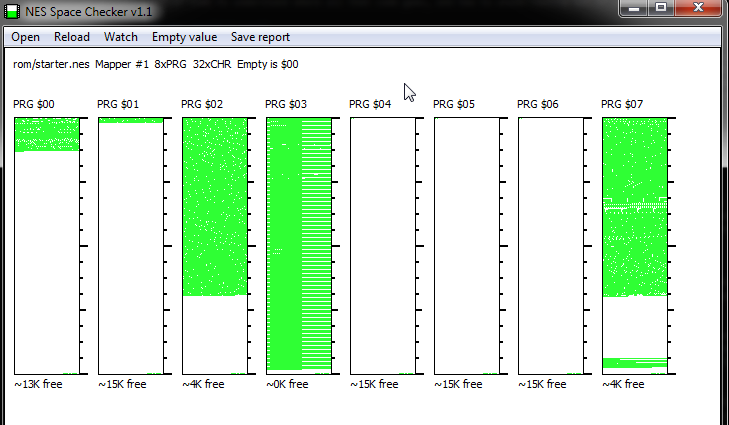

# A Brief Introduction to PRG Banking

We've gotten through the basics of game creation, but up to this point it has been mainly editing existing code.
In section 3, we are going to find ourselves writing a lot more of our own code. It's worth taking a little
bit of time to understand where all that code goes, and how to avoid running out of space.

## Why should I care? 

The NES has a very, very limited amount of program memory (PRG) available for use. Without PRG banking, you
are limited to 32 kilobytes of program data total. That is, 32,000 bytes for everything. All of your game 
logic, your map data, sounds and music. For reference, one game map takes up nearly a full 16kb. The game
logic for the base engine also takes up nearly that much space. How then, can we make a full game within these
restrictions?

The answer is PRG banking. The 32 kilobyte limitation only exists because the NES only knows how to address
that much space. There is no way to tell the console how to run the code at address 32,001 because of the
address mode it uses. (All addresses must be between 0x0000 and 0xffff, and there are other things besides
the PRG memory in that space)

PRG banking gives us a way to take some code out of that space, and put other code in its place. As long
as the processor is not trying to run that code, this works perfectly. Some functions will not be available,
and some other functions become available. It's more clunky than in modern operating systems, but it works. 

## Okay, I'm convinced. How is this laid out?

Basically, when we write our code, we have to tell it where to go, then make sure we have switched to the
right bank before calling that code. The C library has some nice wrappers around this which make it easier
to do.

The first thing to know is how the PRG memory is laid out. This can vary based on what type of rom you are
making, but for our rom the memory is split into two 16KB pieces. One 16kb piece is referred to as the "kernel".
This kernel bank is always addressible in memory, and we put frequently used code into it. For example, the
`main()` method is in the kernel, as are all of the functions neslib provides. 

The other 16kb piece is referred to as the "switchable bank". As the name implies, this bank can be switched to
any one of the other banks we define. The default rom generated by this game has 8 banks; the first one is the
kernel and the rest can be switched out. We allocate one bank for the map, and another bank for a lot of map
and player code. One final bank is used to store music and sound effect data. This leaves 4 banks (mostly) free
for your code and data. (The ROM can also be extended to have 16 banks; see part 5 of the guide.)

Our build tool, `create-nes-game`, will show you stats about how much space is used when you build the game. You
likely have already noticed this. This is a simplified view, but should tell you what you need to know. Here's an
example:

```
$ create-nes-game build
... Build details skipped
[create-nes-game] [info] Game built successfully: rom\nes-starter-kit-example.nes 
[create-nes-game] [info] ==================== 
[create-nes-game] [info] Stats for: nes-starter-kit-example.nes
[create-nes-game] [info] Mapper: mmc1 (skrom) | Rom Size: 262160 bytes. (16b header, 131072b prg, 131072b chr)
[create-nes-game] [info] 89984/131072 bytes free
[create-nes-game] [info] Bank Breakdown:
[create-nes-game] [info] Bank 01: 14002/16384 bytes free
[create-nes-game] [info] Bank 02: 11228/16384 bytes free
[create-nes-game] [info] Bank 03: 8901/16384 bytes free
[create-nes-game] [info] Bank 04: 2250/16384 bytes free
[create-nes-game] [info] Bank 05: 16362/16384 bytes free
[create-nes-game] [info] Bank 06: 16362/16384 bytes free
[create-nes-game] [info] Bank 07: 16362/16384 bytes free
[create-nes-game] [info] Bank 08: 4517/16384 bytes free
[create-nes-game] [info] [afterStepActions build] [sprite_def2img]  [Sat, 11 Feb 2023 05:54:55 GMT]  Success! Image written to graphics/generated/sprites.png 
```

If you'd like a more visual view, there is a great tool called NES Space Checker which can show you this as well. 
You can download this from Shiru's website: [Shiru's Software](http://shiru.untergrund.net/software.shtml).

Here's an example of what the base rom looks like in the tool:



## Great, what do have to do to take advantage of this?

The first thing to do is mark your new code with a bank id. That is a simple call to `CODE_BANK(number)`, where
`number` is your bank number. The `CODE_BANK` macro affects all code in the file below its declaration. You will 
have to reference this bank later when you call the methods in this bank, so it's smart to use a constant for this.
There is a quick example below: (You can see many real ones by searching for `CODE_BANK` in the project.)

`example.h`:
```c
#define PRG_BANK_EXAMPLE_CODE 6

void do_example_things(void);
```

`example.c`:
```c
#include "example.h"

CODE_BANK(PRG_BANK_EXAMPLE_CODE);
const char exampleData[] = {1, 2, 3, 4, 5, 6, 7, 8, 9, 10};
void do_example_things(void) {
    // Do something with exampleData here :D
}
```

The `exampleData` array and the `do_example_things()` method will both be in the 6th bank instead of the
kernel, and we will have to call it using the `banked_call()` method. Continuing our example, here's what
that looks like: 

`main.c`: (Or any other C file)
```c
#include "example.h"

// Lots of code here, then at some point...
case DO_EXAMPLE:
    banked_call(PRG_BANK_EXAMPLE_CODE, do_example_things);
    break;
```

This will trigger a special method in the kernel that will do 4 things for us, in order: 
1. Switch the game to use bank 6.
2. Call the `do_example_things` method while in that bank.
3. Switch the game back to the bank it was on before.
4. Return the value that `do_example_things` returned.

That's it; that's all there is to it!

## Are there any caveats I should know about?

There are only two major caveats to this, but they are definitely worth knowing about.

First, there is a limit to the number of layers deep you can go with banking. If you call
one banked function from another banked function, that is fine, but we have to keep track of 
each bank, and we by default can only track 10 prior banks. This can be increased by changing
`MAX_BANK_DEPTH` in `source/c/library/bank_helpers.h`. (But it will take up more zeropage variables!)

Second, there is no *easy* way to pass through parameters to a method like this. That generally
should be ok, as we want to stick to global variables where possible anyway. If you need to do
this however, you can't use banked_call directly. The last section in this chapter details
how to get around that.

## How can I make a call to a banked method with parameters?

There are some helpers built into our C library to run banked methods with parameters, but
these are not quite as friendly as the `banked_call` method. If you need to do this, you will
need to use the `bank_push` and `bank_pop` methods. These are (effectively) what `banked_call`
does behind the scenes. 

`bank_push` switches the prg bank while putting your current bank onto a stack of known banks,
and `bank_pop` switches the prg bank back afterwards. You end up sandwiching your method between
these two. Here is how we can tweak the example from above to do this: 

First, change the method in `example.c` to accept a parameter: 
```c
void do_example_things(unsigned char potato) {
    // Code goes here
}
```

You will also have to change the header file to match.

Next, change the code in `main.c` to call the new method: 

```c
// Lots of code here, then at some point...
case DO_EXAMPLE:
    bank_push(PRG_BANK_EXAMPLE_CODE);
    do_example_things(5);
    bank_pop();
    break;
```

If you would like to look at a real example, the `load_map()` method in `source/c/map/load_map.c`
does exactly this.