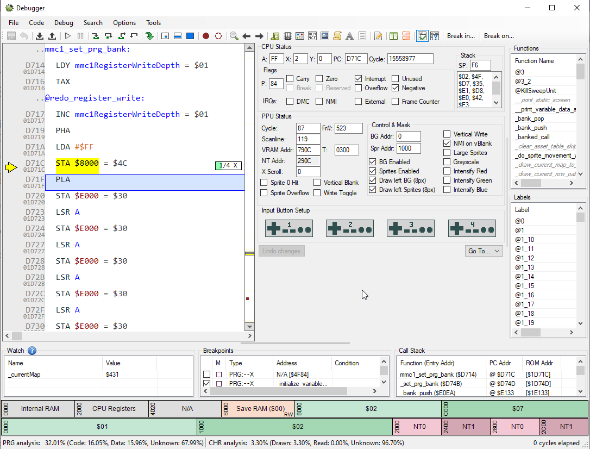
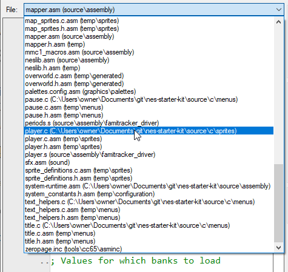
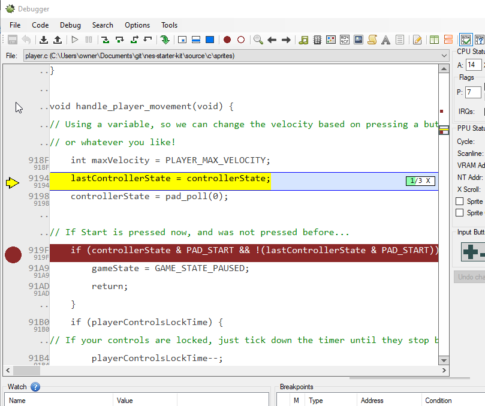
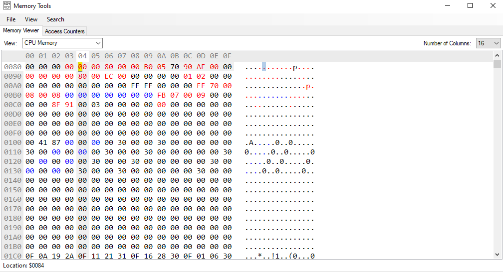
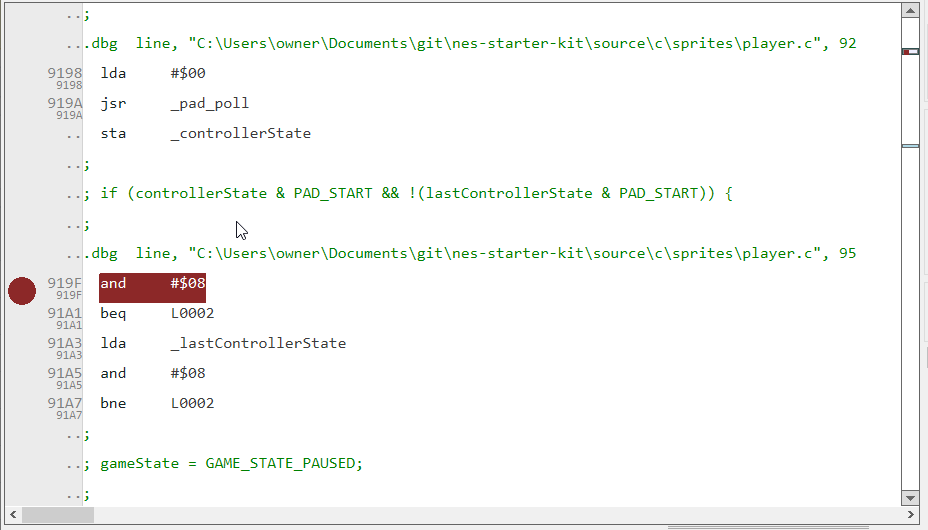
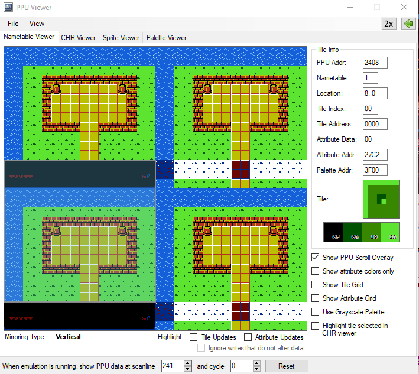
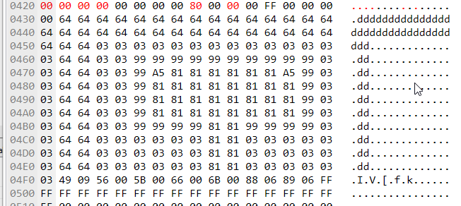

# Debugging your game with Mesen

Starting with version 2.0.0, nes-starter-kit will automatically produce debugging symbols for Mesen for both 
C and assembly code. This means you can use Mesen's built-in debugger to explore how your code runs, and the values
of your variables. This chapter hopes to give you a quick preview of the things Mesen's tools make available to you.

If you're familiar with how to use debuggers, you can probably skip a large portion of this chapter. I also only point
out the features I use most. I encourage you to poke around the buttons and menus to see what's there. The debugger in
Mesen is extremely powerful!

## Using the debugger itself

To start, open your rom in Mesen, then go to the `Debug` menu, and click `Debugger`. Your game will stop - don't panic!
This is expected, You'll note that there is some assembly code on the lefthand side, possibly with some variables you 
might recognize. 

The yellow line is the current line of code being executed. You can control your game's execution with the buttons on
the top of the screen. Hover over them if you are not sure what they do. The "Play" button will start the game back up,
and the "Pause" button will stop the game and show you your spot. 

If you want to get more granular, you can use the buttons to the right of play/pause to get more granular control over
the inputs. This lets you see what a single line does, or step out of the current function. There are also buttons to allow
running a single cpu instruction, a ppu cycle, line, or an entire frame. 

There is also a call stack at the bottom-right, which will show you the list of methods run to get to where you are. Finally,
all of the state of the NES cpu & ppu in the middle. If you're working with assembly, these may be quite useful.

## Debugging using your source code - directly!

Mesen has a really great feature that lets you debug with your own source code, but they hide it a bit. If you right click
the code section, there is an option for "Switch to source view". Click this, and you might see something way more familiar.
(Or, you may see some assembly code; that's okay.) The lefthand panel now has the actual code of the game on display. 

There is a dropdown at the top left now, which will list all files in your project. There will be C files as well as assembly
files for code you've worked on. In short, the C code is "compiled" into assembly code, so you can debug using whichever is
more useful to you at the time. Let's start with the C. Use the dropdown to open "player.c"

Now you'll see the entire source for `player.c` laid out. This will allow us to investigate the code! Search the file
(ctrl+f) and find the definition for `prepare_player_movement`. We'll use this to pause the game without hitting start!

First, click to the far left of the screen next to the line that starts with `if (controllerState & PAD_START &&`. A red
circle should appear. This is a breakpoint! It tells the emulator to stop running the code here, so we can investigate. 

Now hit the "play" button at the top of this screen, and you should see a yellow arrow appear in the middle of the row, and the
line change color to yellow. (If you aren't in the game yet, hit start to leave the main menu.) You are now paused, and can
look at all of the values! If you hover over `gameState` you can see the value is currently 0x32, or 50 in decimal. 
You can hover over other variables as well, such as `controllerState`. (Note: some variables will not show up due to emulator 
limitations. You may have better luck debugging using the assembly version of your file, if you run into this.)

Now, let's edit the value and press start! If you right-click on `gameState` there should be an option similar to 
`Edit in memory viewer (gameState)`. (Make sure the right variable is in parenthesis1) Click this, and you'll be presented 
with a somewhat daunting looking view of the entire memory for your game. 

Don't panic! You don't actually have to understand anything here. The value highlighted in yellow will be the memory address for the
variable you picked. The gameState value for pause is 0x64 (100), so type a `6` then a `4` into that memory location, then start your
game back up. Look at that, it's the pause menu! If you unpause, you will see the debugger take action again.

## Debugging using assembly source

Note: This section does assume a tiny bit of assembly experience. You can skip it if you don't need to get to this level with debugging!

In some cases, debugging C won't quite be enough. If we were to try to change `controllerState` at this point, you would find it does
not do anything. The reason for this isn't obvious from the C source, so let's switch to assembly. If you open `player.c.asm` you
can see what the C file generates. It unfortunately won't automatically jump to the breakpoint on switching, so scroll to the 
red mark on the scrollbar on the right. 

We'll see that the line we stopped on is `and #$08`, which will compare the accumulator with the value for the start button, `0x08`.
We stored the accumulator into `_controllerState`, which means the value is already in the accumulator, so it would be a waste to
read from the memory location again. That's why we can't just change `controllerState` in C and have it work. 

Instead, we can directly update the accumulator, by changing the value `A` under `CPU Status` to the right. Change this to `8`, and hit
the play button. The game is paused!

I've also found that Mesen understands values in assembly more often than it does C, so you may have better luck finding variables in 
the assembly versions of your files.

## Other useful mesen tools

The `Debug` menu in Mesen has a bunch of other very useful utilities, which are worth becoming familiar with. This will
try to give a quick summary of the ones this author finds most useful, but clicking around is encouraged!

### PPU Viewer

The PPU viewer allows you to see all of the graphics your game uses. When you open it, you'll start on the 
`Nametable Viewer` tab. This shows the tiles that are currently on the screen, mostly the same as what you
see in the emulator. (Without sprites) You can also see how our scrolling is done if you walk between screens.

The next tab over is the `CHR Viewer`. This lets you see the various chr tiles, which you may have edited
in a prior chapter about graphics. You can choose between your different chr files, though it will default
to the one currently being used. 

If you select a tile, the section on the right will let you edit tiles in-place and see what it looks like 
in realtime! Note that these changes won't affect the rom, so they will go away as soon as you close mesen, or
reload the rom. So go ahead, draw a smiley face on one of the tiles!

The tab after that is the `Sprite Viewer`. This is fairly self-explanatory. You can edit the tiles on this 
screen as well.

The last tile is the `Palette Viewer`. This will let you see the palettes currently in use on the screen, 
and edit them, just like the tile and sprite viewers. You can use this to test out new color schemes. Make
sure to note down your changes however, as the changes won't affect your game outside of the emulator. 

### Memory Tools & Watch Window

You may have run into the `Memory Tools` window if you walked through the debugger section already. It
lets you see memory locations as they update. If you know the address of your variable, you can watch it
change as the game runs. You can also change the value of any variable from this section easily. We did
this in the debugger section to pause the game. 

One thing that may be interesting is the map. This is around `0x400`- you can sort of see how the tiles
are laid out by looking at it. 

The `Watch Window` is a similar tool, but it will let you pick out individual values to watch their values,
as they change over time. The syntax is a little bit dense, you'll have to hover over the question mark to
see the details. If you want to see the value of a byte, be sure to wrap it in brackets, or you'll get the
address that the value is stored in memory, which doesn't help! 

If you add `[_controllerState]` to the list, you can see the state of the controller as you click buttons.

You'll have to prefix any C variables with an underscore as well, since this is how C variables are 
represented in assembly language. 

Hopefully the information in this section has helped you find ways to explore your rom. Explore the other
tabs too though, and click on things I didn't mention. You may find something useful!