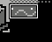

# Using CHR RAM

Ever feel somewhat constricted by the number of tiles you have available to you? Wish you could change one or two small
tiles in CHR without replacing the entire bank? This chapter will help you do just that, with a few caveats. 

## Is CHR RAM right for your game?

CHR ram is very powerful, but also has a lot of drawbacks - it is really a different system than what we use in the
default game (chr rom). CHR rom also has some pros and cons to think about. You'll want to think critically about 
which one to use in your game. In this section I'll try to cover some pros and cons of both briefly. The NESDev
wiki also has [an article on this](https://wiki.nesdev.com/w/index.php/CHR_ROM_vs._CHR_RAM) 
which goes into much greater depth if you're interested.

_Please be warned that using chr ram will cause the text engine in the game to break. It relies on chr rom bank 
switching, and needs a complete rewrite to work with chr ram._

### CHR ROM (default) pros
- Easy to understand
- Bank switching is fast - can even be done multiple times per frame

### CHR ROM (default) cons
- Have to switch entire bank at once (can't update just one tile)
- Limited to the number of chr banks available

### CHR RAM pros
- Tile data can be changed in small increments freely - you can just change 1 tile if you want
- Tile data can be compressed
- Tile data can be generated on-the-fly

### CHR RAM cons
- Tile data takes up PRG space (the space we use for code and constant data)
- Can only update a limited number of tiles per frame (before the screen begins to get glitchy)
- More code to manage and understand
- Can't switch between banks - in our case you only have 2 banks of chr ram
- _nes-starter-kit's text engine does not work - will corrupt the screen when used_

This author would suggest against chr ram for a first project, and if there is a clear way to use chr rom
to do what you need to do. That said, if you really want it, that's what this chapter's here for. If you haven't
been scared off yet, read on!

## Making the switch

The code behind this is available in the [section5_chr_ram](https://gh.nes.science/nes-starter-kit/compare/section5_chr_ram)
branch in github. Feel free to use it to follow along! The completed rom is also available 
[here](https://s3.amazonaws.com/nes-starter-kit/section5_chr_ram/starter.latest.nes).

We need to do a few things to start using chr ram. The first thing is to make some configuration changes to 
use CHR ram in both our rom configuration and within the C startup file. For the configuration, there are
already configuration files ready-to-go in the config directory. 

Rename the following files in the `config/` directory: 

```
ca65.cfg -> ca65.cfg.backup
ca65_constants.asm -> ca65_constants.asm.backup
ca65_chr_ram.cfg -> ca65.cfg
ca65_chr_ram_constants.asm -> ca65_constants.asm
```

Next, we need to stop loading the chr files in our C startup file. Open `source/c/system-runtime.asm` and look for 
the following code:

```asm
.segment "CHR_00"

    ; We just put the ascii tiles into both sprites and tiles. If you want to get more clever you could do something else.
    .incbin "graphics/ascii.chr"
.segment "CHR_01"
	.incbin "graphics/tiles.chr"

; Note: You can put your own separate chr files here to use them... we only use 3 in the demo. This is to avoid warnings,
; and make the rom a predictable size. Note that if you do this you'll have to tweak the engine to support it! There's
; hopefully a guide on how to do this in the repo.
.segment "CHR_02"
    .incbin "graphics/sprites.chr"
.segment "CHR_03"
    .incbin "graphics/tiles.chr"
; ... lots more lines like this
```

Delete all of them. Yes, all of them. This is the code that includes these files into your rom, and you don't want 
them - at least not in this format.

Next, we'll add a couple of them back. Use the following code to put two 4k chr rom banks into the same file, but
in PRG banks instead: 

```asm
; Loads our main ascii and tiles chr data into code bank 5 (currently unused)
.export _main_tiles, _main_sprites, _ascii_tiles
.segment "ROM_05"
    _ascii_tiles:
        .incbin "graphics/ascii.chr"
        _main_tiles: 
        .incbin "graphics/tiles.chr"
	_main_sprites: 
        .incbin "graphics/sprites.chr"
```

Note that you are including these files directly in this case - that is 12k of the 16kb bank used. It is generally
a good idea to compress this data, but this tutorial will not cover that. This will work for us, for now.

Next, we need to actually load this data onto the system. Right now it is sitting on our cartridge doing nothing. If
you were to run the game, you would not actually see anything!

First we need to make these variables accessible. Add the following to `source/c/globals.h`: 

```c
// CHR data loaded in crt0.asm
extern const unsigned char ascii_tiles[];
extern const unsigned char main_tiles[];
extern const unsigned char main_sprites[];
```

There might be a nicer home for this information, but for now that will do. We also need to load the data into chr
each time we need to change it. We can do this by adding two new methods to `source/c/main.c`. Open that file up, and 
add these two new functions to it at the top:

```c
void initialize_chr_ram_menu(void) {
    set_chr_bank_0(0);
    set_chr_bank_1(1);
    bank_push(5);
    vram_adr(PPU_PATTERN_TABLE_0_ADDRESS);
    vram_write((unsigned char*)ascii_tiles, PPU_PATTERN_TABLE_LENGTH);
    vram_adr(PPU_PATTERN_TABLE_1_ADDRESS);
    vram_write((unsigned char*)ascii_tiles, PPU_PATTERN_TABLE_LENGTH);
    bank_pop();
}

void initialize_chr_ram_game(void) {
    set_chr_bank_0(0);
    set_chr_bank_1(1);
    bank_push(5);
    vram_adr(PPU_PATTERN_TABLE_0_ADDRESS);
    vram_write((unsigned char*)main_tiles, PPU_PATTERN_TABLE_LENGTH);
    vram_adr(PPU_PATTERN_TABLE_1_ADDRESS);
    vram_write((unsigned char*)main_sprites, PPU_PATTERN_TABLE_LENGTH);
    bank_pop();
}
```

These two functions will load the chr data from the crt0 file we loaded it from, in the prg bank we chose. This is like
a bank switch, but is slower and requires the ppu to be off. (NOTE: You may wish to put these into their own file, 
perhaps  somewhere in `source/c/graphics` - this likely makes more sense for a real project! We're using `main.c` for 
simplicity.) 

You may not have seen the `bank_push` and `bank_pop` methods before - they are the functions that work behind the
`banked_call` method. `bank_push` switches to chr bank 5, then `bank_pop` switches back to the bank you were using
before. We generally prefer `banked_call`, but that function does not make sense here, since our code is in the
main prg bank, but the data is in a different bank.

**Important**: We now have to call these functions **instead of switching chr banks**,
since we no longer have any extra banks to switch with. Rendering also has to be off each time we call them. We end up
writing this into most of the sections in the `switch` statement in `source/c/main.c`. Please look at this in the branch-
there is too much code to duplicate here.

The last thing we need to do is find all instances of calling `set_chr_bank_0` and `set_chr_bank_1` and remove them -
there is no longer any reason to do this in our code. (With the exception of in the two functions we just added.)

Once you have made all of these changes (or just checked out the git branch `section4_chr_ram`) you should see the game running
as before, though if you pay attention you may find that switching in/out of menus is just a little slower. That's all
great, but how can we actually take advantage of chr ram? Read on!

## Animating tiles by making changes to chr ram on-the-fly

Earlier on in the tutorial series, we had a chapter about animating tiles using chr rom. You can't do that in the same
way due to not being able to switch banks. That said, you _can_ do that using chr ram now. There are many other uses
for chr ram, however this is a nice simple example. (We are only going to do a single 8x8 tile, but this can be
expanded to do all four pieces of 16x16 tile)

**Note that this is _not_ a good way to animate tiles.** It will technically work, but is very limited - two full-sized
16x16 tiles will basically take up all the time you have each frame. This is used as an example to get you going, but
is not a great use of chr ram in general.

First, we need a tile to animate. We'll use the water again. Copy the first corner of the water tile into a set of 
blank tiles, then create a second animation tile next to it. This time, we will want to put 
these files into a separate file from our other chr data. NEXXT has an option under the `Patterns` submenu -> 
`Save Chr` menu to `Save Selection`. Select both 8x8 tiles, and choose to save these into the `graphics` 
folder as `graphics/ocean_tiles.chr`. 



Now, we need to put those tiles into the game. To keep the code simple, we will put this data into the main code bank -
for your game you may want to use another bank. At any rate, add the following code into `graphics/graphics.config.asm`,
around our other chr code: 

```asm
.export _ocean_tiles
.segment "CODE"
    _ocean_tiles: 
        .incbin "graphics/ocean_tiles.chr"
```

We also have to add it to `source/c/globals.h` (or another header file) to make this accessible to our code: 

```c
extern const unsigned char ocean_tiles[];
```

Now that the tiles are available, we have to do some trickery every few frames to load this information into the 
chr memory, so people see it. We are already modifying other parts of the memory map in our `update_hud` method in
`source/c/graphics/hud.c`, so the easiest thing we can do is tack our new code onto this. 

We only want to update a few tiles any given frame, so we will use our `frameCount` variable to update the hud most
frames, then update our ocean tiles every 32 frames. Here's what that code looks like - we wrap the existing
code in an `if` statement, then add our new code in the `else` block.

```c
if ((frameCount & 0x0f) != 0) {
    // Existing hud_update code...
} else {
    // Every 32 frames, we replace part of the "ocean" tile in the background
    // with a different one from our `ocean_tiles` array.

    screenBuffer[0] = MSB(PPU_PATTERN_TABLE_0_ADDRESS + 0x880) | NT_UPD_HORZ;
    screenBuffer[1] = LSB(PPU_PATTERN_TABLE_0_ADDRESS + 0x880);
    screenBuffer[2] = 16;
        
    // j will be our index off of ocean_tiles - if we're on an odd frame, we
    // will set this to 0, otherwise we will set it to the length of 1 
    // tile (16 bytes) so we get the second one.
    if ((frameCount & 0x10) == 0x10) {
        j = 0;
    } else {
        j = 16;
    }

    for (i = 0; i != 16; ++i) {
        screenBuffer[i+3] = ocean_tiles[j++];
    }
    screenBuffer[i+3] = NT_UPD_EOF;
    set_vram_update(screenBuffer);
}
```

Note that if you are actually going to animate tiles like this, you will want to move this method to a new file, and
give it a more fitting name. I suggest using an `if/else` block in `source/main.c` where you choose whether to call
`update_hud()` or `whatever_you_call_your_separate_animation_method()`.

If you're looking to use chr ram, I am going to guess you have more broad plans for this,
so I will leave it to you to back this change out, and do your own thing. (The animation change is in a separate commit
from enabling chr ram, so running `git revert HEAD` will remove those changes quickly.)  

The address (`0x0880`) was gotten from finding the tile id from NES Screen Tool, then tacking 0 to the end of the 
16-bit hex address. (The tile id was `0x88` so the address became (`0x0880`) This works because each tile is exactly
16 bytes long. The other 3 pieces involved in the 16-bit tile would be at `0x890`, `0x980` and `0x990`. 

We only drew the first tile to keep the example code simple and understandable, but you could expand this to draw all
4 tiles. You would need to resize `screenBuffer` to fit the additional data (it is currently 32 bytes long; you would
need 64 bytes of data, plus 6 bytes of positioning information and 1 byte for the `NT_UPD_EOF`, so 71 bytes total. 
You would have to draw the first 32 bytes for the top tiles, then re-set the address and draw the second 32 bytes.

## General notes on how to use chr ram

**IMPORTANT**: You have a very limited time to make all changes to ppu data during each frame. (The time you are able
to draw is known as VBlank.) You can probably manage to send about 160 bytes per frame at most, and that much might
require engine changes. This is enough for about 10 8x8 tiles if you don't do anything else. Plan your chr ram updates
very carefully.

One option for changing part of the chr ram tiles is to create a loop that runs code like we added to `update_hud()` to
add a bunch of new tiles, then just waits for the next VBlank (in other words, it calls `ppu_wait_nmi()`) then updates 
another bunch of tiles. 

Another simpler option is turn off the ppu and use `vram_write()` to write the chr data in one
big batch. Note that this will turn the game screen black until the writing is done and the ppu is turned back on.
This is what we do in the `initialize_chr_ram_menu()` function - the second parameter to `vram_write` is just a
number of bytes to write. This should be the number of 8x8 tiles to write multiplied by 16. (So to write 12 8x8 tiles,
you would use `vram_write((unsigned char*)tiles, (12*16));`.